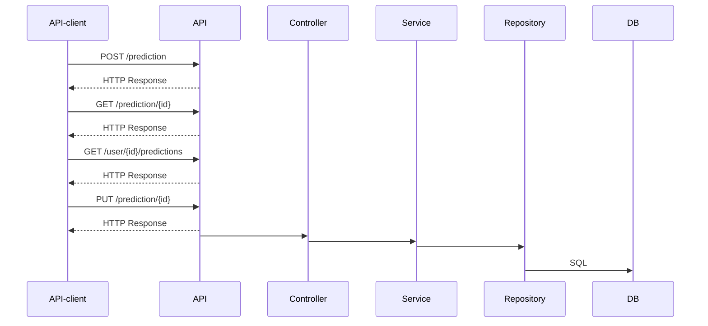

## Development notes

The service has been developed in small increments, with testing at each step.

### Step 1

Service accepts a minimal creation message (only the predicted winner)

### Step 2

Can create a prediction and retrieve it.

To properly test creation, also provide an API to retrieve a prediction.

### Step 3

Predictions must be associated with a user.

Assume that users already exist in the system.

### Step 4

Predictions must be associated with a match.

Assume that 

* matches already exist in the system
* a match just has an id

### Step 5

Return all predictions for a given user

### Step 6

Matches have a start time.

This provides a way to tell if a prediction can be considered closed, and therefore not updatable. 

### Step 7

Predictions can be updated.

Assume only the predicted winner can be changed.

### Step 8

Predictions can be updated, but only if the related match hasn't started yet.

### Step 9

Add Docker support to make the service easier to run locally.

### Step 10

Add some system diagrams.

## System diagram

Showing components and message flows

## Further work that could be done

### Step 11

A match is between two teams. This would allow the predicted winner to be validated.

Assume that

* teams already exist in the system

### Step 12

Add tests for unhappy paths, such as non-existent matches or users.

### Step 13

Require API users to be authenticated e.g. using API keys.

## Running the service

### With Docker

To run the service via Docker, cd to the project directory and run

`docker compose up --build`

Then in another terminal, go to the examples folder

`cd examples`

Run the example scripts

A sample transcript is [included](examples/examples.md)
